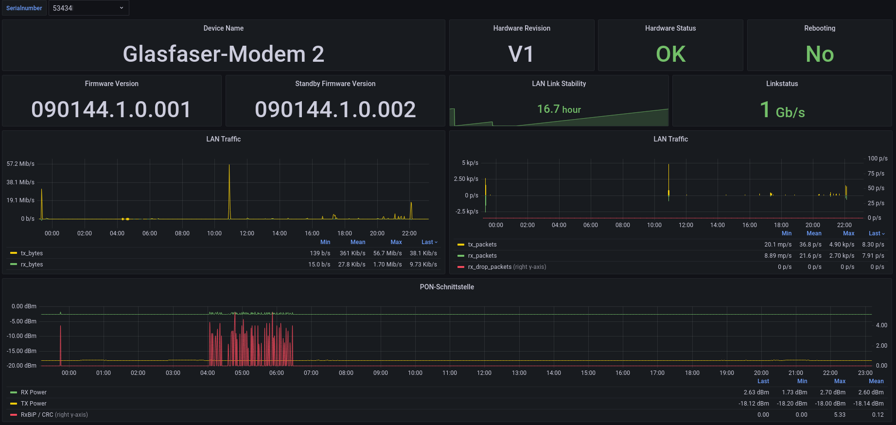

# telegraf-glasfasermodem-2

Telegraf config to poll various stats from a Telekom Glasfasermodem (GPON ONT)
Maybe also works with Huawei HG8010, as it seems that the "Glasfasermodem 2" is just a branded variant of it.

If you already setup the management network, just add the `telegraf/ftth.conf` to your `telegraf.d` directory and restart telegraf.
Otherwise you need to add the IP address `192.168.100.2/24` to the interface (without VLAN) on which the device is connected, for example the WAN interface on your OPNSense router. This has no effect on the PPPoE connection, as this is transferred via VLAN 7.

A Grafana dashboard is provided under `grafana/`. Or download it directly from [grafana.com](https://grafana.com/grafana/dashboards/16433)

# Background
The modem provides a json endpoint on `http://192.168.100.1/ONT/client/data/Status.json`. The hacky processors workaround is unfortunaly need, as the modem outputs ``--`` when no fiber cable is connected or the (unknown) threshold is reached.

Example:

```
[{
        "vartype": "value",
        "varid": "device_name",
        "varvalue": "Glasfaser-Modem 2"
    }, {
        "vartype": "value",
        "varid": "rebooting",
        "varvalue": "0"
    }, {
        "vartype": "value",
        "varid": "ploam_state",
        "varvalue": ""
    }, {
        "vartype": "value",
        "varid": "ploam_success",
        "varvalue": "1"
    }, {
        "vartype": "value",
        "varid": "save_fails",
        "varvalue": "0"
    }, {
        "vartype": "value",
        "varid": "service_mode",
        "varvalue": "0"
    }, {
        "vartype": "page_title",
        "varid": "title",
        "varvalue": "Glasfaser-Modem 2 Konfigurationsprogramm"
    }, {
        "vartype": "value",
        "varid": "datetime",
        "varvalue": "12.06.2022 20:28:08"
    }, {
        "vartype": "value",
        "varid": "firmware_version",
        "varvalue": "090144.1.0.001"
    }, {
        "vartype": "value",
        "varid": "hardware_revision",
        "varvalue": "V1"
    }, {
        "vartype": "value",
        "varid": "fw_version_standby",
        "varvalue": "090144.1.0.001"
    }, {
        "vartype": "value",
        "varid": "hardware_state",
        "varvalue": "1"
    }, {
        "vartype": "value",
        "varid": "txpackets",
        "varvalue": "739608060"
    }, {
        "vartype": "value",
        "varid": "txbytes",
        "varvalue": "934068620159"
    }, {
        "vartype": "value",
        "varid": "rxpackets",
        "varvalue": "383421852"
    }, {
        "vartype": "value",
        "varid": "rxbytes",
        "varvalue": "235323893936"
    }, {
        "vartype": "value",
        "varid": "rxdrop_packets",
        "varvalue": "0"
    }, {
        "vartype": "value",
        "varid": "link_status",
        "varvalue": "1000"
    }, {
        "vartype": "value",
        "varid": "stability",
        "varvalue": "443970"
    }, {
        "vartype": "value",
        "varid": "rxbip_crc",
        "varvalue": "0"
    }, {
        "vartype": "value",
        "varid": "serial_number",
        "varvalue": "REDACTED"
    }, {
        "vartype": "value",
        "varid": "txpower",
        "varvalue": "2.47"
    }, {
        "vartype": "value",
        "varid": "rxpower",
        "varvalue": "-14.19"
    }, {
        "vartype": "value",
        "varid": "ui_version",
        "varvalue": "2.18.161"
    }
]
```
